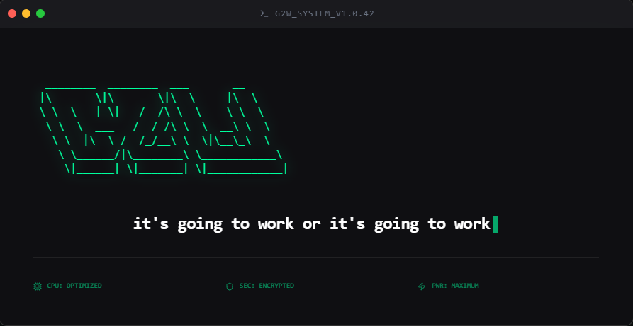

<div align="center">



</div>

# G2W

The best relationships are built on trust. Trust comes from honesty, and honesty breeds clarity and understanding.

I got tired of going in circles with Claude and others because the systems I was using were not set up in a way that builds trust between the user and the model. Some of the top CEOs and big business people who use AI are not concerned with the question — "can it build?" Instead they are focused on — "can we trust what it builds and can we ship it?"

This is not just a workflow system. Not just a task runner. This is a protocol for building trust between you and your AI so what gets built is actually what you envisioned. No more back and forth and all the other bullshit that gets in the way.

**G2W is a relationship protocol.**

---

[](https://www.npmjs.com/package/@only1btayy/g2w)
[](LICENSE)
[](https://claude.ai/code)
[]()

---

```bash
npm install -g @only1btayy/g2w && g2w
```

**Works on Mac, Windows, and Linux.**

---

[The Name](#the-name) · [The Problem](#the-problem) · [How It Works](#how-it-works) · [The Commands](#the-commands) · [How 2 Install](#how-2-install) · [Who It's For](#who-its-for) · [Philosophy](#the-philosophy)

---

## The Name

I named G2W after my motto in life — "It's going to work or it's going to work." This is a perspective shift I had that allows me to view even the apparent losses in life as wins because the gems are in the data. Every loss, every mistake, every doubt and fear we have is data that is filled with gems. We just have to choose to look at it that way. The people who change the world are often considered crazy and delusional until they actually change it. Then the "crazy" becomes genius and the "delusional" becomes relentless. I want you to dare to be relentless in your approach to the challenges in life and remember — it's going to work or it's going to work — ain't no other options.

No in-between. No failure as an option. Two paths and both lead to success.

---

## The Problem

You've worked with AI before. You know how it goes.

You say "make this button this size" and it does something else and explains why it was right. You spend an hour in a discussion session and then have to repeat everything again when it's time to plan. It makes a change that breaks three other things it never bothered to check. It commits code you didn't approve. It guesses instead of asking.

G2W fixes all of that. Not by adding more rules but by building a system that genuinely earns trust.

The problem was never intelligence. The problem was process.

---

## How It Works

---

### The Modular Doc System

Every project gets a full set of living documents — `ARCHITECTURE.md`, `CONVENTIONS.md`, `ERRORS.md`, `CHANGELOG.md`, and more. The rule is simple: when you change code that any doc describes, update that doc in the same session. No separate documentation pass. No stale docs. The knowledge base stays current automatically.

---

### Talk Once. Plan Once. Build.

You start a conversation. You describe your vision. G2W listens, asks smart questions, and runs research silently in the background — tech stack, existing solutions, the ecosystem. By the time you're done talking, the plan is already written and locked.

No separate phases. No repeating yourself. Just a conversation that ends with something ready to build.

Research isn't just a web search. G2W uses Context7 for live library docs, Exa for semantic search across similar projects, Firecrawl to crawl repos and docs sites, and Repomix to pack reference codebases so The Visionary can read how a production-quality version of what you're building actually works. Everything saves to `RESEARCH.md` and persists — future sessions don't re-run research from scratch.

---

### Power-Ups

G2W works out of the box. These optional tools make it stronger:

| Tool | What It Adds |
|---|---|
| [Repomix](https://github.com/yamadashy/repomix) | Packs entire codebases into one AI-optimized file — `bring2life` and research use this |
| [Context7](https://context7.com) | Live library docs pulled into research — no stale training data |
| [Exa](https://exa.ai) | Semantic search for similar projects and best practices |
| [Firecrawl](https://firecrawl.dev) | Deep crawling of repos and docs sites during research |
| [MemPalace](https://github.com/milla-jovovich/mempalace) | Persistent memory across sessions — decisions survive context clears |
| [Superpowers](https://github.com/supermemoryai/superpowers-claude) | Enhanced planning and review capabilities for Claude users |

Install what you want. G2W uses what's available and falls back gracefully when something isn't there.

---

### The Foundation

Once the plan locks, The Foundation takes over. Five roles. One mission. Get it right the first time.

| Agent | Role |
|---|---|
| The Visionary | Writes a complete plan with real decisions and no placeholders |
| The Challenger | Adversarial review — finds every way the plan could fail before coding starts |
| The Builder | Builds exactly what the locked plan says, nothing extra |
| The Inspector | Verifies everything against the plan and loops until it's clean |
| The Leader | Manages the team and keeps everything on track |

The plan is the contract. By the time The Builder touches a single line of code, every decision has already been made.

---

### Optional Methods

Each Foundation agent is also a direct slash command. The normal flow runs through `/g2w:build2gether` and `/g2w:get2work` — but if you know what you're doing, you can jump straight into any stage of the pipeline.

| Command | When to use it directly |
|---|---|
| `/g2w:the-visionary` | You have a half-written plan and just want it finished — skip the full build2gether flow |
| `/g2w:the-challenger` | You wrote your own plan outside G2W and want it stress-tested before building |
| `/g2w:the-builder` | Plan is already locked — skip straight to building |
| `/g2w:the-inspector` | Code is already written — just verify it against a plan |
| `/g2w:the-leader` | Kick off the full pipeline without the identity, brainstorm, and research phases |

These are escape hatches for engineers who don't need the ceremony. G2W has no ceiling.

---

### The Trust Layer

Delivered via hook so it runs every single session, not just when the AI remembers.

- Your explicit instruction is a direct order. No agent may override it, rationalize it away, or route around it.
- The AI answers your question first and then asks to proceed — never just acts.
- No edits outside the declared scope.
- No commits without your approval.
- "I don't know" instead of guessing — always.
- Uncertainty is labeled, not hidden. `[Inference]` and `[Unverified]` are used so you always know what's confirmed and what isn't.
- If scope creeps, it stops and flags it before touching anything.

---

### The A-Game Hook

Before any edit or bug fix, A-Game fires automatically.

- What does this change touch?
- What could break downstream?
- Is this more complex than it looks?
- Does every function, model, or method being referenced actually exist?

Only after working through those questions does execution begin. Taking more time upfront is always better than going in circles.

---

### Git Without The Friction

Safe git operations — add, commit, push, status, log — run without approval prompts. One command handles the whole thing. Add, commit, push. Done. No multi-step back and forth, no unnecessary interruptions. You stay in flow.

---

## The Commands

| Command | What It Does |
|---|---|
| `/g2w:bring2life` | Onboard an existing codebase — scans it, generates your doc files, flags gaps |
| `/g2w:build2gether` | Start a new project — brainstorm, research, and locked plan in one conversation |
| `/g2w:back2it` | Pick up right where you left off |
| `/g2w:get2work` | Execute the current task |
| `/g2w:cut2it` | Fast mode — small tasks, no ceremony |
| `/g2w:back2basics` | Strip context and start clean |
| `/g2w:true2plan` | Verify that what was built actually matches the plan |
| `/g2w:true2dagame` | Full system health check |
| `/g2w:ready2save` | Wrap up the session — update CURRENT.md, capture key decisions and the reasoning behind them, hand off cleanly |

---

## How 2 Install

```bash
npm install -g @only1btayy/g2w && g2w
```

That's it. G2W installs globally into `~/.claude/` automatically — skills and hooks ready in every project, everywhere.

To uninstall:

```bash
npm uninstall -g @only1btayy/g2w
```

Skills and hooks are removed from `~/.claude/` automatically.

> **Tip:** The logo renders in **bright green** in any terminal. On Windows Terminal or iTerm2, enable Retro/Bloom effects for the full glow.

---

## Who It's For

Everyone tired of the bullshit. Vibe coders who just want to ship. Senior engineers who want control. Solo builders with no team and no co-founder.

If you've ever felt like your AI was working against you instead of with you, G2W is for you.

G2W works in other models — the Modular Doc System and commands are model-agnostic. But Claude Code is where it's fully alive. The Trust Layer, A-Game Hook, and context warnings are all hook-delivered, which means they run every single session without relying on the AI to remember. Other models get the workflow. Claude Code gets the guarantees.

---

## The Philosophy

Speed comes from simplicity. Control comes from clarity. If you need a system to manage your system, it's already broken. G2W is not a factory. It's a studio.

---

## Status

Under active development. First real-world test case is Blackhole VST running through `/g2w:bring2life`.

---

*Built by ONLY1BTAYY · MIT License · Claude Code native*
